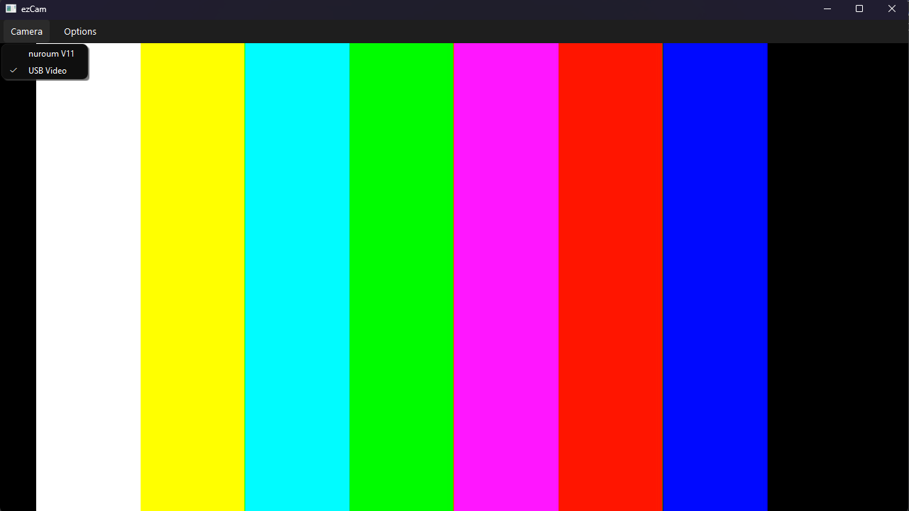

# ezCam 🎥

**ezCam** is a simple webcam viewer built with **C++** and **Qt6**. It supports **fullscreen mode** and allows you to quickly switch between multiple webcams. It's especially useful if you have a capture card and want to check your input quickly.

  
*Preview of ezCam*

## Features (Current) ✅
- Quick switching between connected webcams
- Fullscreen mode
- Lightweight and easy to use

## Planned Features 🚀
- Camera control options (brightness, contrast, etc.)
- Mirror webcam image
- Support for **Linux** and **macOS**

## Installation (Windows) 💻
1. Download the latest Windows release: [Release 0.0.1](https://github.com/mrsna/ezCam/releases/latest)
2. Extract the files and run `ezCam.exe`.
3. Tested on **Windows 10/11**

## License 📄
This project is licensed under the [MIT License](LICENSE.md).

---

> ⚠️ **Note:** This project is in early development. Feedback and suggestions are very welcome!
